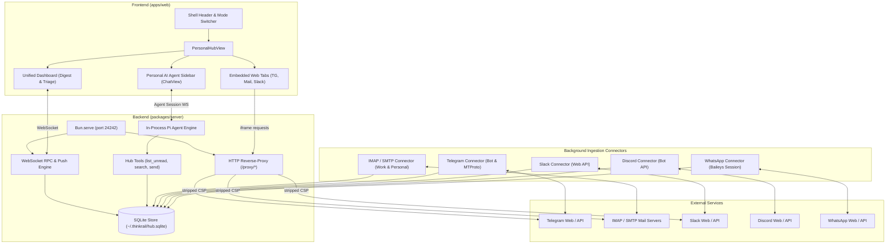

# Personal Agent Control Panel (Personal Hub) Architecture & Roadmap

## 1. Executive Summary & Goals
The goal of this initiative is to evolve ThinkRail from a pure git-worktree coding environment into a comprehensive **Personal Agent Control Panel** ("Панель управления агентами и решения личных задач").

Knowledge workers and developers manage multiple fragmented communication streams throughout the workday. ThinkRail bridges this divide by integrating daily personal and work communications directly into the developer workflow.

The user can:
1. **Aggregate and monitor communication channels** in one browser interface:
   - **Telegram** (personal chats, channels, saved messages)
   - **Email** (work and personal accounts via IMAP/SMTP)
   - **Slack** (work channels and direct messages)
   - **Discord** (developer communities and direct messages)
   - **WhatsApp** (personal messaging)
2. **Interact with official web versions** of messengers and webmail directly in dedicated tabs without browser security restrictions (`Content-Security-Policy` / `X-Frame-Options`), powered by a local streaming reverse-proxy gateway.
3. **Access a Unified Dashboard** providing a daily executive briefing, triage list of unread/urgent messages across all accounts, and active agent task cards.
4. **Leverage the embedded in-process `pi` AI agent** with custom **Personal Hub Tools** to autonomously summarize conversations, draft replies, search across all communications, and extract action items.
5. **Seamlessly switch** between the **Code IDE** view and the **Personal Hub** view via a top-level mode toggle in the UI header.

---

## 2. High-Level Architecture

The Personal Hub consists of five core tiers:
1. **Frontend Web UI (`apps/web`)**: React 19, Tailwind CSS v4, Zustand store. Hosts the top navigation mode switcher (`ide` vs `hub`), the `PersonalHubView` layout, the daily triage dashboard, proxy-embedded web tabs, and the collapsible AI companion sidebar.
2. **Reverse-Proxy Gateway (`packages/server/src/hub/proxy.ts`)**: Built-in HTTP reverse proxy in `@thinkrail/server` running on `/proxy/*`. Strips framing headers (`X-Frame-Options`, `Content-Security-Policy: frame-ancestors`), rewrites upstream cookies and URLs, and enables seamless `<iframe>` embedding of web messengers and webmail inside the browser app.
3. **Local Hub Store (`packages/server/src/hub/db.ts`)**: Embedded SQLite database (`~/.thinkrail/hub.sqlite`) using Bun's native `bun:sqlite` with WAL mode. Stores accounts, normalized messages, channels, and agent tasks with zero external database daemons.
4. **Background Ingestion Connectors (`packages/server/src/hub/connectors/`)**: Asynchronous polling workers for IMAP/SMTP (Work & Personal Email), Telegram (Bot API & MTProto), Slack, Discord, and WhatsApp.
5. **In-Process AI Agent Hub Tools (`packages/server/src/hub/tools.ts`)**: Specialized tools for the `pi` coding agent runtime enabling message querying, full-text search, inbox summarization, and outbound message dispatching.



---

## 3. Data Schema & Contracts

### 3.1 Domain Types (`packages/contracts/src/hubDomain.ts`)

#### Accounts
- **`HubAccountProvider`**: `"telegram" | "email_work" | "email_personal" | "slack" | "discord" | "whatsapp"`
- **`HubAccountStatus`**: `"connected" | "connecting" | "disconnected" | "error" | "syncing"`
- **`HubAccount`**:
  ```ts
  export interface HubAccount {
    id: string;
    provider: HubAccountProvider;
    name: string;
    email?: string;
    status: HubAccountStatus;
    unreadCount: number;
    lastSyncAt: number | null;
    error?: string;
    metadata?: Record<string, unknown>;
  }
  ```
- **`HubAccountSummary`**:
  ```ts
  export interface HubAccountSummary {
    id: string;
    provider: HubAccountProvider;
    name: string;
    email?: string;
    status: HubAccountStatus;
    unreadCount: number;
    lastSyncAt: number | null;
  }
  ```

#### Channels
- **`HubChannelKind`**: `"dm" | "channel" | "group" | "folder" | "thread"`
- **`HubChannel`**:
  ```ts
  export interface HubChannel {
    id: string;
    accountId: string;
    remoteId: string;
    name: string;
    kind?: HubChannelKind;
    unreadCount: number;
    lastMessageAt?: number | null;
    metadata?: Record<string, unknown>;
  }
  ```

#### Messages
- **`HubAttachment`**:
  ```ts
  export interface HubAttachment {
    id: string;
    name: string;
    mimeType?: string;
    size?: number;
    url?: string;
  }
  ```
- **`HubMessage`**:
  ```ts
  export interface HubMessage {
    id: string;
    accountId: string;
    remoteId: string;
    channelId?: string;
    senderName: string;
    senderAddress: string;
    recipientAddress?: string;
    subject?: string;
    body: string;
    snippet: string;
    timestamp: number;
    isRead: boolean;
    isUrgent: boolean;
    hasAttachments: boolean;
    attachments?: HubAttachment[];
    metadata?: Record<string, unknown>;
  }
  ```

#### Agent Tasks
- **`HubAgentTaskStatus`**: `"pending" | "running" | "completed" | "failed" | "cancelled"`
- **`HubAgentTask`**:
  ```ts
  export interface HubAgentTask {
    id: string;
    title: string;
    description?: string;
    status: HubAgentTaskStatus;
    sourceMessageId?: string;
    sourceAccountId?: string;
    suggestedAction?: string;
    createdAt: number;
    completedAt?: number;
    metadata?: Record<string, unknown>;
  }
  ```

#### Filter & Dashboard Summary
- **`HubFilter`**:
  ```ts
  export interface HubFilter {
    accountId?: string;
    channelId?: string;
    provider?: HubAccountProvider;
    isRead?: boolean;
    isUrgent?: boolean;
    query?: string;
    since?: number;
    limit?: number;
    offset?: number;
  }
  ```
- **`HubDashboardSummary`**:
  ```ts
  export interface HubDashboardSummary {
    totalUnread: number;
    accounts: HubAccountSummary[];
    urgentMessages: HubMessage[];
    recentActivity: HubMessage[];
    suggestedAgentTasks: string[];
    activeAgentTasks?: HubAgentTask[];
  }
  ```

### 3.2 WebSocket Protocol Specification (`packages/contracts/src/wsProtocol.ts`)

#### Methods (`WS_METHODS`)
- **`hub.getAccounts`**: `params: { provider?: HubAccountProvider } | Record<string, never>`, `result: { accounts: HubAccount[] }`
- **`hub.getMessages`**: `params: HubFilter`, `result: { messages: HubMessage[]; total: number; hasMore: boolean }`
- **`hub.getDashboardSummary`**: `params: Record<string, never>`, `result: HubDashboardSummary`
- **`hub.markRead`**: `params: { messageIds?: string[]; accountId?: string; channelId?: string; all?: boolean }`, `result: Ack & { modifiedCount?: number }`
- **`hub.sendMessage`**: `params: { accountId: string; recipient: string; body: string; channelId?: string; subject?: string; replyToMessageId?: string }`, `result: { success: boolean; messageId?: string; error?: string }`
- **`hub.syncNow`**: `params: { accountId?: string; force?: boolean }`, `result: { synced: boolean; accountIds?: string[]; error?: string }`

#### Push Channels (`WS_CHANNELS`)
- **`hub.messageReceived`**: Broadcast when a new message is ingested or updated. Payload: `HubMessage`.
- **`hub.accountStatusChanged`**: Broadcast when an account connects, fails, or sync status/unread count changes. Payload: `{ accountId: string; status: HubAccountStatus; unreadCount: number; error?: string }`.
- **`hub.syncStatus`**: Broadcast to indicate background sync start/progress/finish. Payload: `{ accountId?: string; isSyncing: boolean; progress?: string; error?: string }`.

### 3.3 SQLite Storage Schema (`~/.thinkrail/hub.sqlite`)

```sql
CREATE TABLE IF NOT EXISTS hub_accounts (
    id TEXT PRIMARY KEY,
    provider TEXT NOT NULL,
    name TEXT NOT NULL,
    email TEXT,
    status TEXT NOT NULL,
    unread_count INTEGER DEFAULT 0,
    last_sync_at INTEGER,
    error TEXT,
    metadata TEXT
);

CREATE TABLE IF NOT EXISTS hub_channels (
    id TEXT PRIMARY KEY,
    account_id TEXT NOT NULL,
    remote_id TEXT NOT NULL,
    name TEXT NOT NULL,
    kind TEXT,
    unread_count INTEGER DEFAULT 0,
    last_message_at INTEGER,
    metadata TEXT,
    FOREIGN KEY(account_id) REFERENCES hub_accounts(id) ON DELETE CASCADE
);

CREATE TABLE IF NOT EXISTS hub_messages (
    id TEXT PRIMARY KEY,
    account_id TEXT NOT NULL,
    remote_id TEXT NOT NULL,
    channel_id TEXT,
    sender_name TEXT NOT NULL,
    sender_address TEXT NOT NULL,
    recipient_address TEXT,
    subject TEXT,
    body TEXT NOT NULL,
    snippet TEXT NOT NULL,
    timestamp INTEGER NOT NULL,
    is_read INTEGER DEFAULT 0,
    is_urgent INTEGER DEFAULT 0,
    has_attachments INTEGER DEFAULT 0,
    attachments TEXT,
    metadata TEXT,
    FOREIGN KEY(account_id) REFERENCES hub_accounts(id) ON DELETE CASCADE,
    FOREIGN KEY(channel_id) REFERENCES hub_channels(id) ON DELETE SET NULL
);

CREATE INDEX IF NOT EXISTS idx_hub_messages_timestamp ON hub_messages(timestamp DESC);
CREATE INDEX IF NOT EXISTS idx_hub_messages_account ON hub_messages(account_id, is_read);
CREATE INDEX IF NOT EXISTS idx_hub_messages_urgent ON hub_messages(is_urgent, is_read);

CREATE TABLE IF NOT EXISTS hub_agent_tasks (
    id TEXT PRIMARY KEY,
    title TEXT NOT NULL,
    description TEXT,
    status TEXT NOT NULL,
    source_message_id TEXT,
    source_account_id TEXT,
    suggested_action TEXT,
    created_at INTEGER NOT NULL,
    completed_at INTEGER,
    metadata TEXT
);
```

---

## 4. Security, Credentials & Privacy

- **Local Storage**: All credentials, tokens, and local message history remain strictly on the local machine under `~/.thinkrail/`.
- **File Permissions**: Account configurations and credentials stored in `~/.thinkrail/hub-accounts.json` are written with strict user-only permissions (`0600`).
- **Telemetry Boundaries**: No personal communications, email contents, chat transcripts, or authentication credentials are sent to external analytics or telemetry endpoints.
- **Embedded Proxy Isolation**: The `/proxy/*` gateway runs on loopback `localhost:24242` and only routes to configured trusted web clients. Cookie headers are namespaced to avoid leaking host credentials.

---

## 5. Development Roadmap & Milestones

### Milestone 1: Contracts and Architecture Specification (Current)
- Complete `docs/PERSONAL_HUB_PLAN.md` specification.
- Define domain models and types in `packages/contracts/src/hubDomain.ts`.
- Extend WebSocket protocol in `packages/contracts/src/wsProtocol.ts`.
- Export contracts through `packages/contracts/src/index.ts`.
- Add unit tests verifying contract schemas and protocol versions.

### Milestone 2: Server Hub Module & Local SQLite Store
- Initialize SQLite store via `bun:sqlite` in `packages/server/src/hub/db.ts`.
- Create tables, indices, and CRUD data-access methods.
- Implement `/proxy/*` streaming reverse proxy in `packages/server/src/hub/proxy.ts` and mount in `server.ts`.
- Configure Vite proxy forwarding in `apps/web/vite.config.ts`.
- Implement WebSocket RPC handlers for `hub.*` methods in `packages/server/src/hub/handlers.ts`.

### Milestone 3: Priority Ingestion Connectors (Email & Telegram)
- Build IMAP/SMTP connector supporting TLS, unread sync, and message delivery for personal and work accounts.
- Build Telegram connector supporting Bot API updates and MTProto client notifications.
- Implement secure credential store in `~/.thinkrail/hub-accounts.json`.
- Implement background sync scheduler with manual refresh trigger (`hub.syncNow`).

### Milestone 4: AI Agent Hub Tools & Personal Assistant Skill
- Implement `pi` agent tools (`hub_list_unread`, `hub_search_messages`, `hub_send_email`, `hub_send_telegram`, `hub_summarize_inbox`) in `packages/server/src/hub/tools.ts`.
- Register hub tools in `packages/server/src/agent/extensions.ts`.
- Create personal assistant system prompt instructions and triage skills in `packages/server/src/hub/skill/SKILL.md`.

### Milestone 5: UI Shell Mode & Personal Hub Dashboard
- Add `viewMode: "ide" | "hub"` in `apps/web/src/store/appStore.ts`.
- Add mode switch buttons in the header bar of `apps/web/src/shell/Shell.tsx`.
- Create `PersonalHubView.tsx` with sidebar channels, unread badges, central viewport, and collapsible assistant sidebar.
- Implement `DashboardView.tsx` with daily summary cards, triage list, and action buttons.
- Implement `ProxyEmbedView.tsx` with iframe embedding, reload, external window fallback, and agent quick prompts.

### Milestone 6: Multi-Channel Expansion (Slack, Discord, WhatsApp)
- Implement Slack connector using Slack Web API for channel mentions and direct messages.
- Implement Discord connector using Discord Bot API and Webhooks.
- Implement WhatsApp connector using headless web session (Baileys) or Cloud API.
- Add corresponding UI tabs and badges to `PersonalHubView.tsx`.
- Extend agent tools to support cross-channel search and dispatching across all 5 providers.
